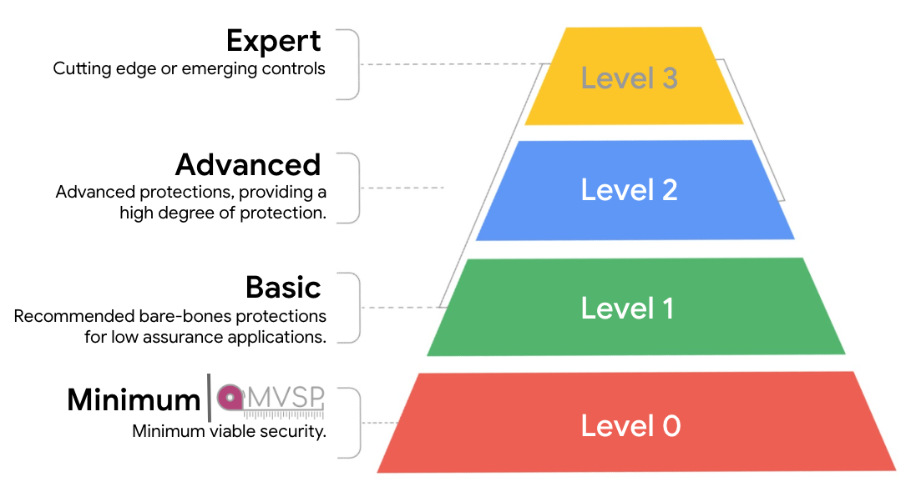

# Application Security Maturity Levels (ASML)

Application Security Maturity Levels (ASML) is a framework that attempts to
captures Google security teams opinions and experience in a measurable
governance-friendly manner. Each ASML domain describes application security
requirements using a multi-leveled approach that is designed to be easy to
understand, and useful for everyone, not just those who develop using specific
tech stacks.

NOTE: This project is ongoing effort, and will expand over time to include
additional domains. Google security are sharing this publicly to allow external
stakeholders to re-use elements where they may find it useful within their own
security programs.

---

## Leveled approach
ASML uses 4 levels of maturity - **Minimal**, **Basic**, **Advanced**, and
**Expert**.

### Minimal (Level 0)
_This level represents common-sense protections that every “reasonably-secure”
application should include._

This level will stay aligned with the MVSP industry minimum application security
baseline where there is coverage for any of the ASML domains.

### Basic (Level 1)
_This level represents basic controls recommended for low assurance
applications._

The security requirements in this level address the largest control gaps and the
most serious application security risks.

### Advanced (Level 2)
_This level represents the level for high security product and service launches,
and critical systems that need additional layers of protected._

The security requirements in this level are significantly higher than those in
the lower levels, and they include defense in depth. It is expected that
existing applications work towards meeting these requirements over time.

### Expert (Level 3)
_This level represents cutting-edge, advanced, niche, and/or difficult-to-deploy
security controls/features._

The security requirements in this level are not enforced, but may be enabled by
default in some modern frameworks, and in certain circumstances. Google aims to
make these security controls/features easier to adopt and to, eventually, move
them to a lower level(s).

NOTE: A number of emerging controls are consistently being tracked for possible
inclusion into Level 3. Once these technologies reach suitable maturity, they
will be included.

---

## ASML Program

### Objectives
* Define a standardized framework through which Google can define application
security requirements
* Communicate application security requirements in a way that can be used to
measure risk and support decision-making processes similar to other leveled
sets of requirements
* Provide consistent maturity level assessments to reduce the need for manual
review by security engineers

### Framework guidelines
The ASML framework aims to maintain the follow guidelines:

1. Use a consistent format to describe and communicate each application security
control
2. Present controls using four increasing maturity levels aligned to a clear
use-case and risk
3. Ensure use-cases and scopes are clear to ease identification of required
maturity level(s)
4. Avoid duplication of controls by reusing security requirements within
multiple domains where appropriate

### Existing work
ASML builds on, and includes controls from [Minimum Viable Secure Product
(MVSP)](https://mvsp.dev) where applicable for a given domain. These controls
are mapped to Minimal (Level 0).

#### How is ASML different to MVSP?
**MVSP** is an industry minimum application security baseline for
enterprise-ready products and services. It has seen strong industry adoption
since being established in 2021. It is currently in the public domain and
supported by a working group of companies. MVSP contains a single set of
controls, with a goal of setting the minimum acceptable controls.

## This is not an official Google product.
**ASML** is a framework used by Google to describe sets of security controls
categorized by maturity levels. It is designed to allow for measurement of
application security maturity, and can be used to automate elements of ongoing
monitoring for application security controls. ASML's growing maturity levels aim
to allow for continued growth beyond the minimum, and represent Google security
teams opinions.
